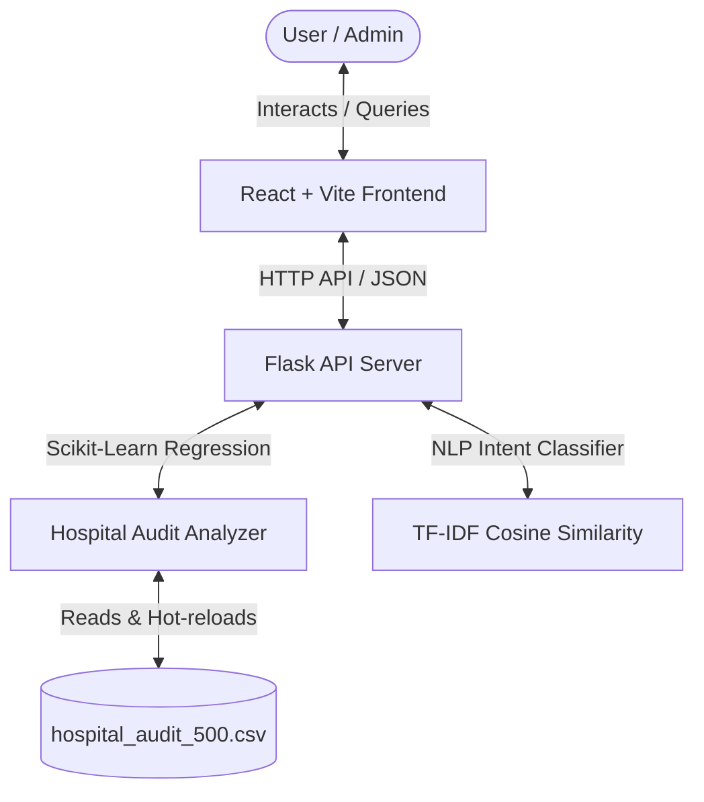
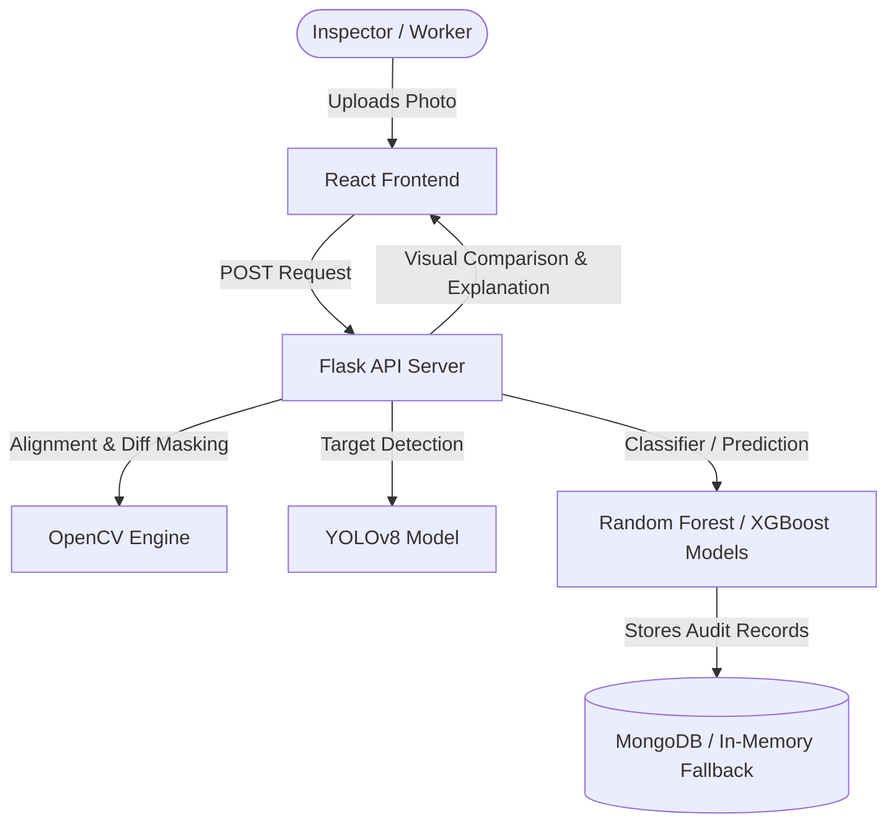

# 🏥 Hospital Audit Intelligence & AI Proof Checker Suite

Welcome to the **Hospital Audit Intelligence & AI Proof Checker Suite**. This repository contains two premium, full-stack applications designed to revolutionize hospital operations, compliance monitoring, and physical audit verification:

1. **Reallist Audit (AI-Powered Assistant & Dashboard)**: An analytics panel and natural language AI assistant that parses audit logs, runs scikit-learn forecasting models, and handles complex queries locally.
2. **Hospital AI Image Proof Checker (Computer Vision & Predictions)**: A visual verification portal that registers uploaded photos, runs YOLOv8 object detection to check for expected safety equipment/hygiene targets, and predicts audit resolution success probabilities using machine learning models.

---

## 🏗️ System Overview & Workflow

### 1. Reallist Audit Analytics & Chatbot
This sub-project targets compliance dashboard data visualization and chatbot inquiry answering. It monitors compliance against NABH benchmarks ($\ge 80\%$) and projects hospital risk trends dynamically.


### 2. Hospital AI Proof Checker
This sub-project targets automated photo verification. A worker takes a physical photo of a ward/room and uploads it. The backend compares it against a checklist reference template to verify that mandatory equipment (e.g., drip stands, monitors, fire extinguishers) is present.


---

## ✨ Features

### Reallist Audit Assistant
*   **Dynamic Analytics Dashboard**: Real-time evaluation of risk scores, compliance percentages, pending/failed audits, and open escalations.
*   **Predictive Risk Analytics**: Linear regression forecasting of hospital risk trends and compliance changes for 7-day and 30-day projection intervals.
*   **NLP Intent Classification**: Embedded chatbot recognizing and resolving queries (e.g., *"Which ward has the highest risk?"*, *"Who needs training?"*) using local TF-IDF vectorization and cosine similarity.
*   **Staff Performance Audits**: Metrics ranking staff by pass rates, tracking failed audits, and generating training recommendations.

### AI Image Proof Checker (Underlying CV Engine)
*   **YOLOv8 Object Detection**: Uses pre-trained deep learning weights (`yolov8n.pt`) to detect equipment (such as beds, drip stands, monitors, waste bins, or fire extinguishers) inside photos.
*   **Image Alignment & Differential Masking**: Automatically registers proof photos with reference configurations and generates visual difference masks highlighting new/missing objects.
*   **Secure Dual-Role Authentication**: Support for manager and worker credentials out of the box.
*   **Checklist Template Creator**: Dynamically create new audit configurations for any floor, ward, or room, complete with custom required target objects and reference photos.
*   **ML Resolution Prediction Dashboard**: Uses scikit-learn Random Forests and XGBoost models to evaluate issue resolution timeframes and success probabilities based on historical factors.
*   **MongoDB Atlas Integration with Memory Fallback**: Connects to MongoDB Atlas for persistence but falls back seamlessly to an in-memory mock database if offline.

---

## 📂 Project Structure

```
├── backend/                   # Consolidated Flask backend server and ML/CV modules
│   ├── app.py                 # Flask server routes & chat API endpoints (runs dashboard & chatbot APIs)
│   ├── data_analyzer.py       # Core analytics & scikit-learn forecasting logic
│   ├── nlp_engine.py          # TF-IDF & cosine similarity intent classification
│   ├── requirements.txt       # Python dependencies for the backend
│   ├── hospital_audit_500.csv # Audit log dataset copy
│   ├── db.py                  # Database connection / memory mock fallback
│   ├── vision_engine.py       # OpenCV image comparison & YOLOv8 detection logic
│   ├── ml_model.py            # Random forest verification classifier
│   ├── explanation_engine.py  # AI explanation summary generator
│   ├── resolution_ml_model.py # ML training for resolution success prediction
│   ├── resolution_prediction_engine.py # Evaluation & scoring of issues
│   ├── resolution_data_engine.py # Feature extraction for resolution times
│   ├── resolution_explanation_engine.py # Generates explanations for prediction values
│   ├── yolov8n.pt             # YOLOv8 pre-trained model weights
│   ├── seeder.py              # Seeds initial checklists & reference assets
│   └── static/                # Uploaded references, proofs, and diffs (ignored in git)
├── frontend/                  # Consolidated Vite + React (v19) + Tailwind CSS (v4) frontend
│   ├── src/
│   │   ├── components/        # Active components (Chatbot window & Dashboard visualization)
│   │   │   ├── Chatbot.jsx    # Floating chatbot assistant interface
│   │   │   └── Dashboard.jsx  # Main dashboard display
│   │   ├── pages/             # Pages for image verification suite
│   │   │   ├── AlertsPanel.jsx
│   │   │   ├── AuditHistory.jsx
│   │   │   ├── ChecklistManagement.jsx
│   │   │   ├── Dashboard.jsx  # Unused page for image checker dashboards
│   │   │   ├── Login.jsx
│   │   │   ├── ResolutionPredictionDashboard.jsx
│   │   │   ├── UploadProof.jsx
│   │   │   └── VerificationResult.jsx
│   │   ├── App.jsx            # Main app entrypoint, layout & dark mode
│   │   └── index.css          # Tailwind setup
│   └── package.json           # Frontend dependencies & run scripts
├── hospital_audit_500.csv     # Global audit logs dataset
├── generate_csv.py            # Generates mock audit log CSV data
├── verify_backend.py          # Python script verifying NLP and analytics models
└── README.md                  # Project documentation
```

---

## 🛠️ Prerequisites

*   **Python 3.10+**
*   **Node.js 18+** & **npm**
*   *Optional:* **MongoDB Atlas Connection** (defaults to automated memory mock database if offline or not configured).

---

## 🚀 Running the Applications

### 1. Setup Backend
1. Navigate to the backend folder:
   ```bash
   cd backend
   ```
2. Create and activate a virtual environment:
   * **Windows**:
     ```powershell
     python -m venv venv
     .\venv\Scripts\Activate.ps1
     ```
   * **macOS/Linux**:
     ```bash
     python3 -m venv venv
     source venv/bin/activate
     ```
3. Install dependencies:
   ```bash
   pip install -r requirements.txt
   ```
4. Launch the Flask API server:
   ```bash
   python app.py
   ```
   *Runs on [http://localhost:5000](http://localhost:5000)*

### 2. Setup Frontend
1. Navigate to the frontend folder:
   ```bash
   cd ../frontend
   ```
2. Install dependencies:
   ```bash
   npm install
   ```
3. Start the Vite dev server:
   ```bash
   npm run dev
   ```
   *Runs on [http://localhost:5173](http://localhost:5173)*

---

## 💬 Sample Chatbot Queries (Reallist Audit)

Try asking the AI Assistant queries like:
*   *“Which ward has highest risk?”*
*   *“Predict future risk”*
*   *“Show compliance score trend”*
*   *“List pending audits”*
*   *“Best performing staff”*
*   *“Who needs training or attention?”*
*   *“Is ICU hygiene risk increasing during night shifts?”*
*   *“NABH compliance score showing steady improvement this week”*

---

## 🧪 Model & Component Verification

To run automated checks on the NLP intent classifier and CSV parsing logic:
```bash
python verify_backend.py
```
This script will validate:
1. Cosine similarity classifications for chatbot queries.
2. Hospital risk scores and multi-day linear regression calculations.