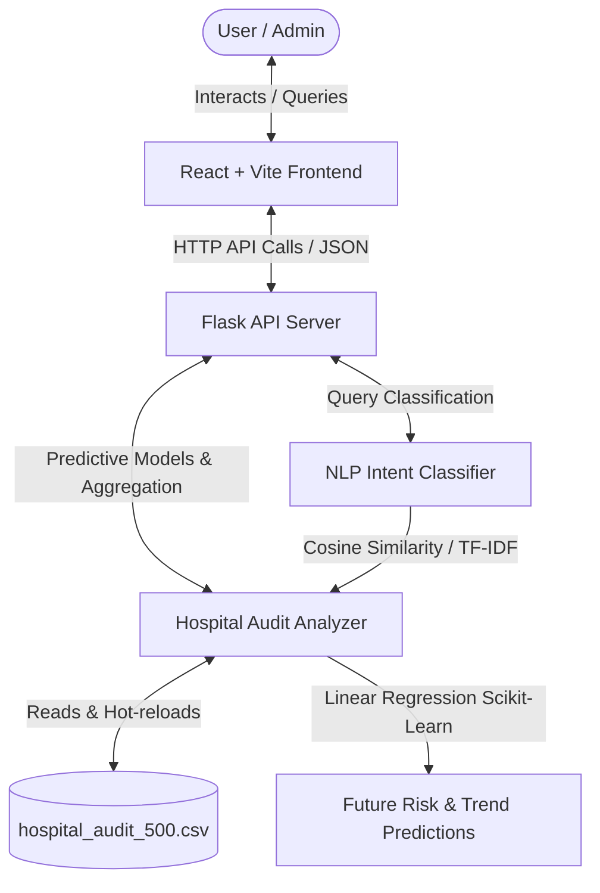

# 🛡️ Reallist Audit: AI-Powered Hospital Audit Analytics & Chatbot Assistant

Reallist Audit is a premium, full-stack hospital audit intelligence dashboard and natural language AI assistant. It processes and analyzes audit log datasets (`hospital_audit_500.csv`) dynamically, running machine learning predictions and natural language intent classification entirely locally.

---

## 🏗️ System Architecture & Workflow

The application consists of a **Vite + React** frontend and a **Flask (Python)** analytics backend. Here is how the systems interact:



### Key Workflow Steps
1. **Dynamic Hot-Reloading**: The Flask backend monitors the `hospital_audit_500.csv` dataset. Any local changes or updates to the CSV are automatically reloaded at the start of every request.
2. **Predictive Analytics**: Using `scikit-learn` linear regression, the analytics engine projects hospital risk scores for the next 7 and 30 days, calculates daily compliance slopes, and evaluates whether risk levels are improving, declining, or stable.
3. **NLP Intent Classifier**: When a user queries the chatbot, the NLP engine vectorizes the text using TF-IDF and uses cosine similarity to classify the input against trained intent phrases, retrieving real-time data calculations from the analyzer.

---

## ✨ Features

*   **Dynamic Visual Dashboard**: Real-time monitoring of overall risk, compliance score, NABH compliance benchmark (threshold $\ge 80\%$), pending/failed audits, and open escalations.
*   **Predictive Risk Intelligence**: Linear regression forecasting of hospital risk trends and weekly compliance adjustments.
*   **Actionable Recommendation Engine**: Custom corrective actions generated automatically based on risk metrics, staff performance, and ward bottlenecks.
*   **Staff Performance Analysis**: Tracks top-performing staff, flags those needing training/attention, and lists staff with the most failed audits.
*   **Interactive NLP Chatbot**: An embedded chatbot in the UI that resolves queries dynamically from the audit dataset.
*   **Curated Aesthetics**: Beautiful glassmorphic components, dark mode toggle, smooth micro-animations, and full mobile responsiveness.

---

## 🛠️ Tech Stack

*   **Frontend**: React, Vite, Tailwind CSS, Lucide icons, Framer Motion.
*   **Backend**: Flask, Flask-CORS, Python.
*   **Analytics & Machine Learning**: Pandas, NumPy, Scikit-Learn (Linear Regression models, TF-IDF Vectorizer, Cosine Similarity metrics).

---

## 🚀 Getting Started & Run Commands

Follow these instructions to run the application locally.

### Prerequisites
*   **Python 3.10+**
*   **Node.js 18+** & **npm**

---

### 1. Backend Setup

1.  Navigate to the backend directory:
    ```bash
    cd backend
    ```
2.  Create a virtual environment (recommended):
    ```bash
    python -m venv venv
    ```
3.  Activate the virtual environment:
    *   **Windows (Command Prompt)**:
        ```cmd
        venv\Scripts\activate.bat
        ```
    *   **Windows (PowerShell)**:
        ```powershell
        .\venv\Scripts\Activate.ps1
        ```
    *   **macOS / Linux**:
        ```bash
        source venv/bin/activate
        ```
4.  Install the required dependencies:
    ```bash
    pip install -r requirements.txt
    ```
5.  Run the Flask application:
    ```bash
    python app.py
    ```
    *The API server will start on [http://localhost:5000](http://localhost:5000).*

---

### 2. Frontend Setup

1.  Navigate to the frontend directory:
    ```bash
    cd frontend
    ```
2.  Install the required dependencies:
    ```bash
    npm install
    ```
3.  Start the development server:
    ```bash
    npm run dev
    ```
    *The frontend will start on [http://localhost:5173](http://localhost:5173).*

---

## 💬 Sample Chatbot Queries

You can ask the Reallist AI Audit Assistant questions like:
*   *“Which ward has highest risk?”*
*   *“Predict future risk”*
*   *“Show NABH compliance”*
*   *“Show pending audits”*
*   *“Show failed audits”*
*   *“Who needs attention?”*
*   *“Show hygiene audit results”*
*   *“Best performing staff”*

---

## 📂 Project Structure

```
├── backend/
│   ├── app.py                 # Flask server routes & API endpoints
│   ├── data_analyzer.py       # Core analytics & scikit-learn forecasting logic
│   ├── nlp_engine.py          # TF-IDF & cosine similarity intent classification
│   ├── requirements.txt       # Python dependencies
│   └── venv/                  # Local python virtual environment (ignored in git)
├── frontend/
│   ├── src/
│   │   ├── components/
│   │   │   ├── Dashboard.jsx  # Main analytical visualization dashboard
│   │   │   └── Chatbot.jsx    # Chatbot window & conversational interface
│   │   ├── App.jsx            # Main app entrypoint, layout, & dark mode handler
│   │   ├── main.jsx           # React DOM root render
│   │   └── index.css          # Styling & Tailwind setup
│   ├── package.json           # Frontend scripts & dependencies
│   ├── vite.config.js         # Vite configuration
│   └── tailwind.config.js     # Tailwind design system tokens
├── hospital_audit_500.csv     # The audit logs dataset
├── generate_csv.py            # Script to generate sample/mock audit data
└── README.md                  # Project documentation
```