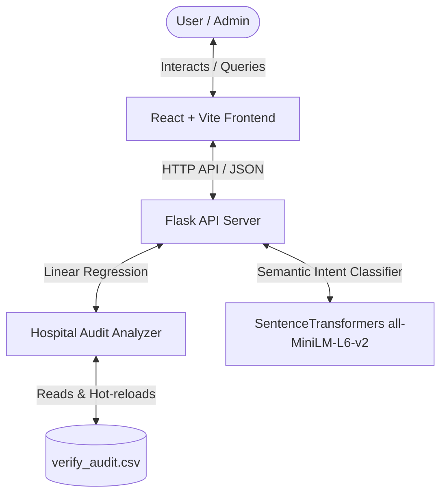

# 🏥 Hospital Audit Intelligence & AI Chatbot Suite

Welcome to the **Hospital Audit Intelligence & AI Chatbot Suite**. This repository contains a premium, full-stack application designed to revolutionize hospital operations, compliance monitoring, risk forecasting, and automated audit validation.

---

## 🏗️ System Overview & Architecture

This system targets compliance dashboard visualization and interactive semantic chatbot query answering. It dynamically calculates compliance metrics, predicts risk trends using machine learning regression, and resolves natural language queries via local vector similarity.



---

## ✨ Core Features & Implementation Details

### 1. Local Semantic Search Chatbot (SentenceTransformers)
*   **Zero-Cloud Dependency**: Fully local intent detection using the **`all-MiniLM-L6-v2`** model. No external API calls are made (no OpenAI, Gemini, or Claude), preserving privacy and eliminating usage costs.
*   **Semantic Matching**: Resolves query meaning rather than relying on exact keyword matching. For example, queries like *"Which ward has the highest risk?"*, *"Which ward is most dangerous?"*, and *"Where should management focus first?"* all resolve to the same intent (`highest_risk_ward`).
*   **Cosine Similarity Matching**:
    *   Pre-computes and normalizes high-dimensional embeddings for 37 distinct intents (over 280 training phrases).
    *   Computes cosine similarity via dot product (`np.dot`) between query embeddings and the training corpus.
    *   Uses a strict similarity threshold of **`0.40`** to filter out unrelated inputs and routes unknown intents to a friendly fallback state.

### 2. Structured Chatbot Responses
To ensure actionable insights, chatbot responses are dynamically structured using the following format:
*   **`### Answer`**: A concise direct answer to the user's query.
*   **`### Reason`**: Bulleted lists containing specific, calculated metrics (e.g., risk scores, fail rates, names of staff, or affected locations) pulled directly from the audit log.
*   **`### Recommendation`**: Practical, data-driven suggestions (e.g., staff training, equipment checks, safety inspections) to mitigate the highlighted issues.

### 3. Predictive Risk Analytics (Scikit-Learn Regression)
*   **Linear Regression Projections**: Fits historical audit records against time to forecast **7-day** and **30-day** risk and compliance scores.
*   **Specific Sub-Trend Projections**:
    *   **Floor 3 Waste Disposal**: Tracks biomedical waste risk and compliance changes over time specifically on Floor 3.
    *   **Surgery Department Fire Safety (OT)**: Projects fire safety compliance and extinguisher status trends in the Surgery department/Operating Theater.

### 4. Standardized Hospital Audit Dataset (`verify_audit.csv`)
The application operates on a single source of truth: `verify_audit.csv`, which contains exactly **500 realistic records** matching real-world hospital operational constraints:
*   **Mapped Departments & Divisions**:
    *   `Outpatient` ➔ `Hygiene`
    *   `Patient Care` ➔ `Sanitization`
    *   `Critical Care` ➔ `Infection Control`
    *   `Diagnostics` ➔ `Biomedical Waste`
    *   `Surgery` ➔ `Fire Safety`
*   **Column Schema**:
    *   `audit_id`, `date`, `floor`, `ward`, `department`, `division`, `checklist_name`, `status` (`Pass`, `Fail`, `Pending`), `priority` (`Low`, `Medium`, `High`), `assigned_staff`, `completion_time`, `image_uploaded` (`Yes`, `No`), `escalation_status` (`None`, `Open`, `Resolved`), `remarks`, `risk_score`, `compliance_score`.

---

## 📂 Project Structure

```
├── backend/                   # Flask server, data analysis, and NLP engine
│   ├── app.py                 # Flask server routing, API logic, and response formatting
│   ├── data_analyzer.py       # Scikit-learn regression models & audit calculations
│   ├── nlp_engine.py          # SentenceTransformers model loader and cosine similarity search
│   ├── requirements.txt       # Python dependencies (Flask, Pandas, Scikit-learn, SentenceTransformers)
│   ├── venv/                  # Local Python virtual environment
│   └── verify_audit.csv       # Standardized 500-record source of truth dataset
├── frontend/                  # React dashboard and chatbot user interface
│   ├── src/
│   │   ├── components/        
│   │   │   ├── Chatbot.jsx    # Chatbot panel featuring structured Answer-Reason-Recommendation formatting
│   │   │   └── Dashboard.jsx  # Analytics graphs, status counts, and predictive projections
│   │   ├── App.jsx            # Parent shell and visual themes (including dark/light mode toggle)
│   │   └── index.css          # Tailwind CSS configurations
│   └── package.json           # React dependencies & scripts (Tailwind CSS v4, Lucide-React, Framer Motion)
├── verify_backend.py          # Validation script verifying semantic search and math accuracy
└── README.md                  # System documentation
```

---

## 🛠️ Installation & Setup

### 1. Prerequisites
Ensure you have the following installed:
*   **Python 3.10+**
*   **Node.js 18+** & **npm**

### 2. Set Up the Backend
1. Navigate to the backend directory:
   ```bash
   cd backend
   ```
2. Activate the pre-existing virtual environment:
   * **Windows**:
     ```powershell
     .\venv\Scripts\Activate.ps1
     ```
   * **macOS/Linux**:
     ```bash
     source venv/bin/activate
     ```
3. Install required dependencies:
   ```bash
   pip install -r requirements.txt
   ```
4. Start the Flask server:
   ```bash
   python app.py
   ```
   *The backend will run on [http://localhost:5000](http://localhost:5000)*

### 3. Set Up the Frontend
1. Navigate to the frontend directory:
   ```bash
   cd ../frontend
   ```
2. Install frontend dependencies:
   ```bash
   npm install
   ```
3. Start the Vite React development server:
   ```bash
   npm run dev
   ```
   *The frontend will run on [http://localhost:5173](http://localhost:5173)*

---

## 💬 Sample Chatbot Queries

Try asking the assistant queries such as:
*   *“Where should management focus first?”* (Resolves to highest risk ward)
*   *“Which floor has the highest risk score?”*
*   *“Predict future risk”* (Runs linear regression forecast)
*   *“Who needs training or attention?”* (Identifies underperforming staff)
*   *“List pending audits”*
*   *“Is ICU hygiene risk increasing during night shifts?”*
*   *“NABH compliance score showing steady improvement this week”*

---

## 🧪 Automated Testing & Verification

To verify that the semantic model matches intents correctly and that statistical calculations align perfectly with the source data:
```bash
backend\venv\Scripts\python.exe verify_backend.py
```
This script validates:
1. **Semantic Intent Accuracy**: Confirms that query variations map successfully to their intended target intents.
2. **Dashboard Calculations**: Validates risk scores, pass rates, and regression outputs against `verify_audit.csv`.