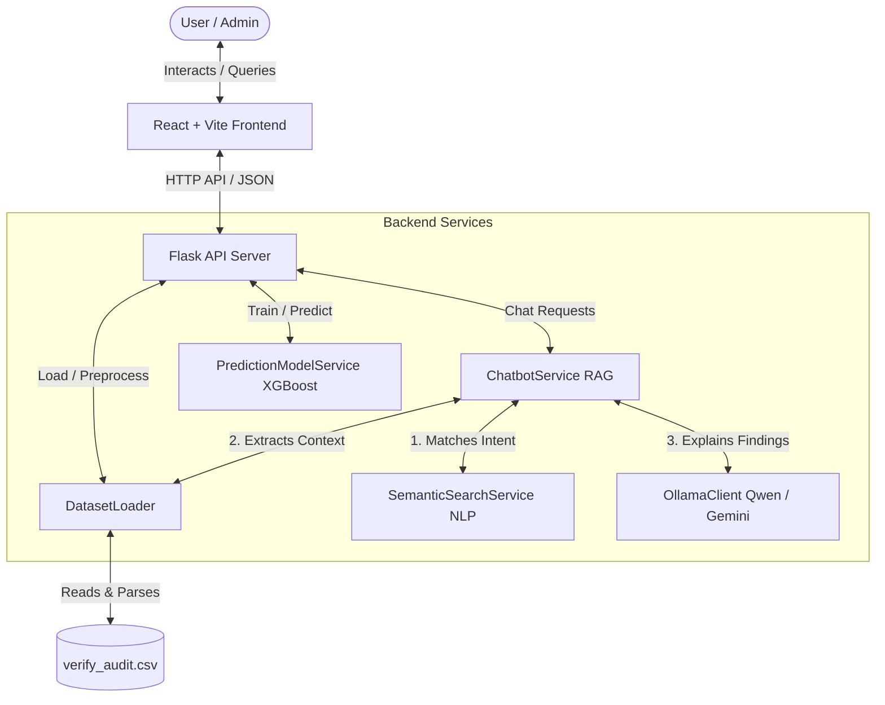

# 🏥 Hospital Audit Intelligence & AI Chatbot Suite

Welcome to the **Hospital Audit Intelligence & AI Chatbot Suite**. This premium platform upgrades your standard hospital audit logs into an interactive, local AI-powered RAG (Retrieval-Augmented Generation) assistant. 

It calculates compliance metrics, predicts risk/compliance trends using **XGBoost Regressors**, and answers natural language queries using a local **Sentence Transformer** and local LLM (**Ollama Qwen2.5**) with online fallbacks (**Google Gemini / Groq**).

---

## 🏗️ System Overview & Architecture

The application is structured into a clean decoupled backend (Flask) and a glassmorphic dashboard frontend (React + Vite).



---

## ✨ Core Features & Implementation Details

### 1. Local RAG Chatbot (SentenceTransformers & Qwen)
*   **Semantic Intent Matching**: Maps user queries (e.g. *"Show failed audits"*) to specific analytical intents using a local **`all-MiniLM-L6-v2`** Sentence Transformer and Cosine Similarity thresholds.
*   **Zero-Hallucination Pipeline**: The chatbot **never generates fake numbers**. When a question is asked:
    1. The Python backend runs precise Pandas calculations on the dataset first.
    2. Relevant raw logs are retrieved and formatted as text context.
    3. The calculations and logs are passed into a system prompt.
    4. The LLM (local Qwen2.5 or online Gemini) summarizes and recommends actions based *only* on the verified calculations.
*   **Conversation History**: Includes a slide-over history drawer in the chat window, storing up to 15 previous queries in `localStorage` for fast re-running.

### 2. Predictive AI Model (XGBoost Regressors)
*   **Dual XGBoost Predictors**: Predicts **Risk Scores** and **Compliance Scores** (0-100) using Extreme Gradient Boosting (`XGBoost Regressors`) trained on local audit features.
*   **Feature Engineering**: Uses date features (Hour, Day of the Week, Month, elapsed timeline) and NLP semantic text embeddings (384-dimensions) computed from the qualitative audit `Remarks` text.
*   **On-Demand Model Retraining**: Features a **"Retrain AI Models"** button on the dashboard. When clicked, the backend fits, serializes, and hot-reloads the updated XGBoost json weights locally.

### 3. Glassmorphic Analytics Command Center
*   **11 AI Predictive Cards**: Displays predicted risk/compliance scores, high-risk locations, top-performing users, and weekly/daily risk trend directions.
*   **Weekly Quartile Trend Charts**: Displays the Risk and Compliance trends grouped by week (labeled by their starting Monday date). Uses an **`ComposedChart`** to show:
    *   **Quartile Range (Q1 - Q3)**: A shaded range band showing the spread of the middle 50% of the audits.
    *   **Average Score (Mean)**: A bold solid line showing overall direction.
    *   **Median Score**: A dashed line representing the middle value.
*   **Distribution Visualizations**: Charts for Status Distribution, Top 5 Checklist Volumes, Location Audit Distribution, and Audit Volumes per Month.

### 4. Standardized Audit Dataset (`verify_audit.csv`)
Operates on the hospital audit log dataset containing:
*   `Created By` (Assigned Auditor)
*   `Created At` (Date and time of audit)
*   `Location` (Building/Floor/Zone hierarchy)
*   `Checklist Name` (Specific inspection type)
*   `Remarks` (Qualitative audit notes)
*   `Status` (`Pass`, `Fail`, `Pending`)

---

## 📂 Project Structure

```
├── backend/                      # Flask server, data analysis, and ML engine
│   ├── app.py                    # Flask server routing, API logic, and charts formatting
│   ├── data_analyzer.py          # Interface for data metrics and predictions
│   ├── nlp_engine.py             # Matches quick intent codes using embeddings
│   ├── requirements.txt          # Python dependencies (Flask, xgboost, scikit-learn, sentence-transformers)
│   ├── .env                      # Cloud LLM API Keys (Gemini/Groq) fallback configuration
│   ├── models/                   # Folder holding trained json weights for XGBoost Regressors
│   ├── services/                 
│   │   ├── dataset_loader.py     # Parses raw CSV and builds virtual metrics columns
│   │   ├── prediction_model.py   # NLP Feature extractor and XGBoost training pipeline
│   │   ├── semantic_search.py    # Retrieves semantic logs and maps intent embeddings
│   │   └── chatbot_service.py    # Coordinates local RAG calculations and prompts
│   ├── utils/
│   │   └── ollama_client.py      # Local Ollama client with Google Gemini & Groq HTTP API fallback
│   └── verify_audit.csv          # 500-record hospital audit logs dataset
├── frontend/                     # React dashboard and chatbot user interface
│   ├── src/
│   │   ├── components/        
│   │   │   ├── Chatbot.jsx       # ChatGPT-style floating widget with history drawer
│   │   │   └── Dashboard.jsx     # AI Command Center layout, cards, and Composed Charts
│   │   ├── App.jsx               # Parent shell with Light/Dark mode toggles
│   │   └── index.css             # CSS and Tailwind styling
│   └── package.json              # React dependencies (recharts, lucide-react, framer-motion)
├── verify_backend.py             # Validation script verifying semantic search and math accuracy
└── README.md                     # System documentation
```

---

## 🛠️ Installation & Setup

### 1. Set Up the Backend
1. Navigate to the backend directory:
   ```powershell
   cd backend
   ```
2. Run using the pre-existing virtual environment:
   ```powershell
   # Windows:
   .\venv\Scripts\python.exe app.py
   ```
   *The backend runs on [http://localhost:5000](http://localhost:5000)*

### 2. Set Up the LLM (Choose Option A or B)

#### Option A: 100% Local Inference (Recommended)
1. Download and install **Ollama** from **[https://ollama.com/download](https://ollama.com/download)**.
2. Open a new terminal and download the lightweight Qwen model (986 MB):
   ```bash
   ollama run qwen2.5:1.5b
   ```
3. Once downloaded, keep the Ollama server running. The Flask backend will automatically auto-detect it.

#### Option B: Online API Fallback (No Local Download)
1. Get a free API Key from **[Google AI Studio](https://aistudio.google.com/)**.
2. Open the [backend/.env](file:///e:/chatbot-demo/backend/.env) file and add your key:
   ```env
   GEMINI_API_KEY=AIzaSyYourGeneratedAPIKeyHere
   ```
3. Restart your Flask server. The system will automatically route prompts to Gemini Flash.

### 3. Set Up the Frontend
1. Open a new terminal and navigate to the frontend directory:
   ```powershell
   cd frontend
   ```
2. Start the Vite React development server:
   ```powershell
   npm run dev
   ```
   *The frontend runs on [http://localhost:5173](http://localhost:5173)*

---

## 🧪 Automated Testing & Verification

Run the validation suite to verify the NLP classifier, model imports, and calculations:
```powershell
backend\venv\Scripts\python.exe verify_backend.py
```
Outputs `=== ALL BACKEND CHECKS PASSED SUCCESSFULLY ===` when all mathematical and intent assertions pass.